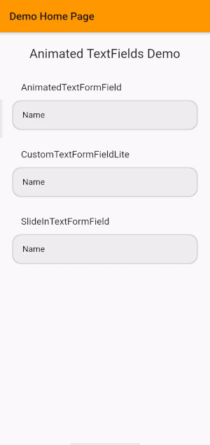

# animated_textformfields

A Flutter package that has a collection of animated (and some not so animated) TextFormFields to make UI development faster and more beautiful.

## Example



<a class="github-button" href="https://github.com/thealphaversion" aria-label="Follow @thealphaversion on GitHub">Follow @thealphaversion</a>


## Descriptions

#### Animated TextFormField

The Animated TextFormField toggles between animatiion states based on wheter is has focus or not. When the textformfield has focus, the textformfield animates the color and the corners of the textformfield.

#### SlideIn TextFormField

The SlideIn TextFormField animates between the hint text showing up inside the text field when the text is empty, and above the textformfield when it is filled with text.

#### Custom TextFormField Lite

The Custom TextFormField is a textformfield that does not animate. It is be used to complete another animated TextFormField, but can also be used as a standalone version. 


## Sample

#### Animated TextFormField

```
AnimatedTextFormField(
    width: MediaQuery.of(context).size.width * 0.875,
    height: 48.0,
    inputType: TextInputType.text,
    hintText: "Name",
    controller: textEditingControllerAnimated,
    textStyle: TextStyle(
        color: Colors.black,
        fontSize: 16.0,
    ),
    focusNode: myFocusNode,
    cornerRadius: BorderRadius.circular(14.0),
)
```

#### SlideIn TextFormField

```
SlideInTextFormField(
    vsync: this,
    width: MediaQuery.of(context).size.width * 0.875,
    height: 48.0,
    inputType: TextInputType.text,
    fieldText: "Name",
    controller: textEditingControllerSlideIn,
    textStyle: TextStyle(
        color: Colors.black,
        fontSize: 16.0,
    ),
    cornerRadius: BorderRadius.circular(14.0),
)
```

#### Custom TextFormField Lite

```
CustomTextFormFieldLite(
    width: MediaQuery.of(context).size.width * 0.875,
    height: 48.0,
    inputType: TextInputType.text,
    hintText: "Name",
    controller: textEditingControllerLite,
    textStyle: TextStyle(
        color: Colors.black,
        fontSize: 16.0,
    ),
    cornerRadius: BorderRadius.circular(14.0),
)
```